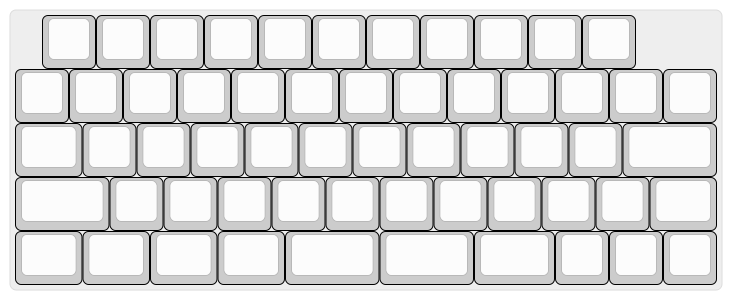

# slz40
PCB and keymap files for the SLZ40, a 40s style keyboard with numbers for Zhuyin input.

The PCB requires a Pro Micro (or comparable) controller as well as 58 diodes, 58 MX style switches

The sandwich case takes M2 screws and standoffs.

You can find the key caps required in the following layout.

cap size | number 
-------|-------
1u | 47 
1.25u | 6
1.5u | 1
1.75u | 4

[QMK toolbox](https://docs.qmk.fm/#/) is required to flash the layout 

The default keymap can be found in the keymap folder.
