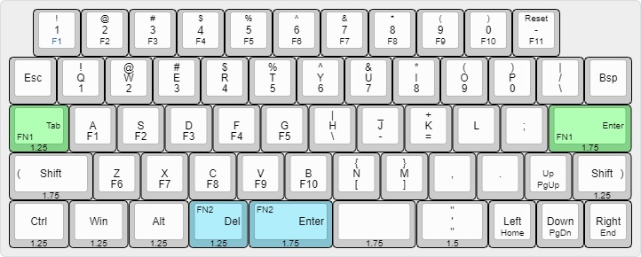

# The default keymap for slz40

The green keys are tap/hold for fn1 layer, the blue keys are tap/hold for fn2 layer

Remember to map a reset key in your keymap. Otherwise you will have to access the reset key physically to flash a new keymap.
